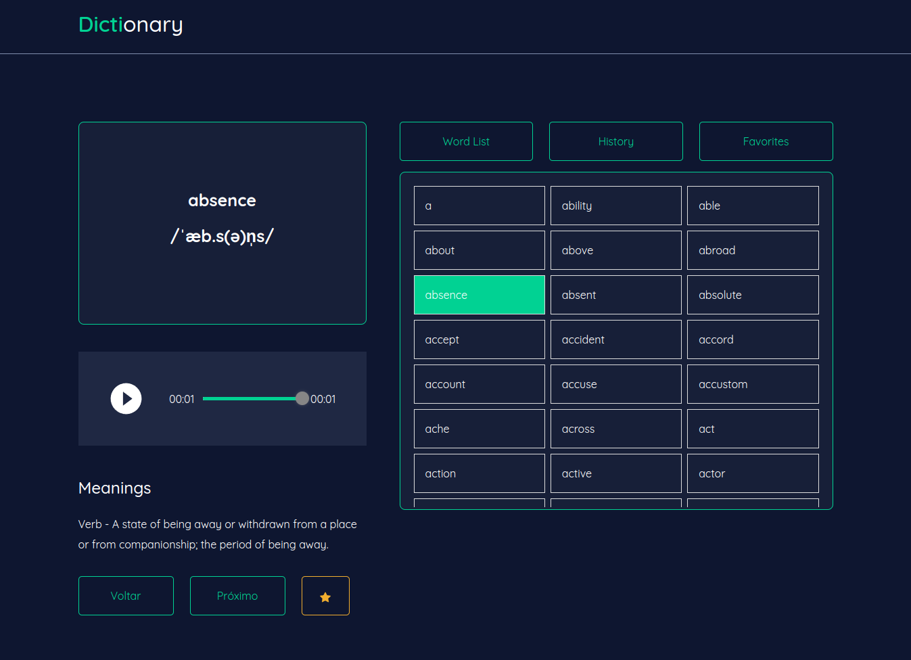

<h1 align="center">
    
</h1>

<h4 align="center"> 
	:heavy_check_mark: Dictionary App 🚀 :heavy_check_mark:
</h4>
<p align="center">	
	
  <a href="https://www.linkedin.com/in/julio-cesar-filho-759653171">
    
  </a>
</p>
<p align="center">
</p>

O projeto Dictionary foi feito com Next.js. Ele é um dicionário que lista diversas palavras em inglês e faz uma busca na API do freeDictionaryAPI para retornar o dialeto, audio e outras infos bem legais. 

Nele você pode ouvir audio da palavra, salvar uma como favorita, ver o histórico de ultimas palavras vistas.
E ele é 100% responsivo.

:rocket: Technologies

O projeto foi desenvolvido utilizando as tecnologias abaixo:

- [Next.js][nextjs]
- [Typescript][typescript]
- [Styled Components][styled-components]
- [Axios][axios]
- [react H5 Audio Player][reacth5]
- [Json Server][jsonserver]
- [Memory Cache][memorycache]
- [Bootstrap][bootstrap]
- [React Toastify][react-toastify]
- [Next Pwa][next-pwa]

:globe_with_meridians: Acesso o projeto clicando [aqui](https://juliofilho.me/).


:construction: Como testar:

Clonse a aplicação utilizando o [Git](https://git-scm.com), [Node.js][https://nodejs.org] + [Yarn][https://yarnpkg.com]. Tenha o node e o yarn nas versões mais recentes. Eu usei o Node na V16.15.1.

Rode os seguintes comandos abaixo:

### :gear: Instalar o Front-end dictionary_web

```bash
# Clone this repository
$ git clone https://github.com/JulioCesar012/dictionary_web.git

# Go into the repository
$ cd dictionary_web

# Install dependencies
$ yarn

# Rodar em desenvolvimento
$ yarn dev

# Rodar em modo produção
$ yarn build
$ yarn start

# running on port 3000
```

## :desktop_computer: Váriavel ambiente

Para você poder testar o projeto sem impedimentos ou problemas de conexão eu subi uma api com todas palavras e objetos que a aplicação precisa, não é uma api complexa, mas ela já está hospedada na Vercel, é só adicionar no .env ou .env.local esse váriavel `API_JSON_SERVER` e adicionar a url abaixo e já irá funcionar.

`API_JSON_SERVER=https://dictionaryapi.vercel.app`

Esse é um desafio da Coodesh `#challenge by coodesh`

# Rodar a API (backend) local

Caso você não queira usar a api que deixei hospedada na Vercel, poderá baixar o projeto dela aqui no meu git, [nesse link](https://github.com/JulioCesar012/dictionary_api). Após baixar só entrar na pasta `dictionary_api` e rodar o `yarn`, feito isso, rode o `yarn dev` em ambos projetos e no `dictionary_web` deixe a váriavel `API_JSON_SERVER` vazia. E teste a aplicação.


:telephone_receiver: Qualquer dúvida estou a disposição.

# OBS: 

eu implementei recurso de salvar histórico e favoritos no localstorage então as apis de salvar histórico e favoritos que estavam sendo usadas agora estão desativadas e usando o storage.

Made with ♥ by JulioCesar012 :wave: [Get in touch!](https://www.linkedin.com/in/julio-cesar-filho-759653171/)

[nextjs]: https://nextjs.org
[typescript]: https://www.typescriptlang.org
[styled-components]: https://styled-components.com
[axios]: https://axios-http.com/ptbr/docs/intro
[reacth5]: https://www.npmjs.com/package/react-h5-audio-player
[jsonserver]: https://www.npmjs.com/package/json-server
[memorycache]: https://www.npmjs.com/package/memory-cache
[bootstrap]: https://reactstrap.github.io
[react-toastify]: https://fkhadra.github.io/react-toastify
[next-pwa]: https://www.npmjs.com/package/next-pwa
